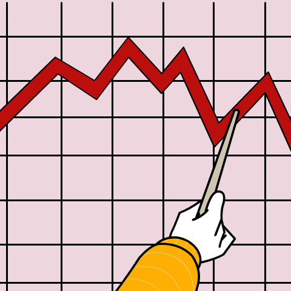

  

<h1 align="center">Ebraheim Salem</h1>
<h2 align="center">Mr. Fox</h2>

  Founder of <a href="https://pbcex.com">PBCEx</a> · Trader · Building Next.js apps with AI

---

## Table of Contents

* [Now Trading / Now Building](#now-trading--now-building)
* [PBCEx](#pbcex)
* [Source Timeline (S.E.P.T.)](#source-timeline-sept)
* [Other Builds](#other-builds)
* [AI Development Stack](#ai-development-stack)
* [Product Stack](#product-stack)
* [Connect](#connect)

---

## Now Trading / Now Building

I trade global markets and build the rails for them at the same time.

* Trading: crypto, precious metals, select equities and indices
* Building: a spot exchange for physical commodities, for retail and institutions
* Goal: allocated, asset-backed rails where retail, producers, and institutions clear on the same stack

> markets: crypto, commodities, equities  
> building: PBCEx, automation lab  
> location: Pittsburgh, PA  
> mode: shipping, not polishing

Right now I am focused on:

* Shipping the PBCEx MVP, spot trading and allocated storage with insured fulfillment in one account
* Price aggregation, hedging, and dashboards for metals and FX flows
* Agent-driven ops: ledgers, support drafts, monitoring, and journaling

---

## PBCEx

People's Brokerage and Commodities Exchange. Trade, save, store, spend, and ship real metal.

PBCEx is a spot exchange for physical commodities. Users fund with USD or crypto, set limit orders on real metal, accumulate fractional positions at wholesale pricing, and take physical delivery on demand. Every position is backed one to one in allocated storage. Customers only pay product premiums when shipping or vaulting. When they sell back, PBCEx offers a competitive buyback price. The platform covers the full cycle: fractional accumulation, price-controlled entry, segregated vaulting, and near-spot resale on exit.

* Wholesale metals: (FizConnect API)
* Allocated storage and fulfillment: IDS Vault
* Crypto trading and custody: Embeded API
* Wholesale-to-retail spread on physical, plus fractional pool trading on our own ledger
* Long-term: tokenized commodity rails and a dedicated settlement stack

Core public repos:

* [`abes-pbcex-workspace`](https://github.com/Abe99987/abes-pbcex-workspace), monorepo for backend, frontend, and ops tooling
* `PBCEx-Obsidian`, knowledge base, specs, and architecture decision records
* Admin and ops terminals for risk, hedging, support, and investor tiles

---

## Source Timeline (S.E.P.T.)

A separate project on evidence-first history.

S.E.P.T. stands for Source, Event, Place, Time. Source S said event E happened at place P during time T.

The idea:

* Every entry has who, what, when, where, and why
* Evidence attached: people, places, things, photos, notes, papers, journals
* A chain of evidence, who wrote this, when, and who handled and submitted it
* Meta tags:
  * People (e.g., Martin Luther King Jr., George Washington)
  * Places (e.g., Shanghai, China)
  * Things (e.g., AI, F-22 jet)
  * Lens (e.g., Religion, Finance, Research, News)

We usually read the victor's version of history. S.E.P.T. focuses on:

* Storyline, the why and how, not just the what
* Backlinks between correlated events
* Higher correlation and stronger evidence equals higher probability scores

Repo:

* [`Timeline`](https://github.com/Abe99987/Timeline), evidence-based historical timeline with S.E.P.T. indexing

---

## Other Builds

Outside of PBCEx:

* Meat export and slaughterhouse dashboard, live beef prices and export data wired into a charting interface so an exporter can track spreads and opportunities
* Internal tools and experiments:
  * Micro-manufacturing and metals workflows
  * Ops dashboards for logistics and payments
  * Utilities around trading, journaling, and research

Most use the same core stack: Next.js, TypeScript, NestJS, and AI-assisted workflows.

---

## AI Development Stack

I run an AI-centered workflow anchored by an Obsidian and GitHub second brain.

Context layer:

* Obsidian vault and GitHub repos with front-matter and tags, mirrored as a unified index
* Retrieval-augmented context across AI tools, with model-context-protocol-style patterns

Workflow loop:

1. Plan and prompt with GPT-class models using template and meta prompts
2. Build and test with Anthropic models in Cursor
3. Use CodeRabbit and Codex for pull-request gating and review
4. Close each session with an architecture decision record and a session journal in the knowledge base

Quality control:

* Manual review after builds and again after test runs
* Final pass after PR review to catch regressions
* Clear audit trail and fast iteration cycles

Terminal setup:

* iTerm2 plus tmux running parallel command-line agents (Claude, Gemini, Grok, internal scripts)
* Repos wired for multi-agent workflows

Agents in use:

* Price aggregation agent that pulls from several sources to build a live range
* Customer-support drafting agent that prepares responses for human review
* Markets agent that generates daily price charts and stats for internal dashboards

Hybrid architecture:

* Local models on a NAS for sensitive data
* Cloud models for general reasoning
* SDK kits, for hybrid interfaces
* Running Qwen, LLaMA, and GPT-class models locally for experiments and agent-builder projects
* Express and NestJS wrappers for serving

---

## Product Stack

Frontend

* Next.js and React on Cloudflare
* Trading interfaces with embedded charting

Backend

* NestJS on Fly.io
* REST and streaming endpoints for ledgers, dashboards, and price feeds

Data and Infra

* PostgreSQL via Supabase
* Redis via Upstash
* Docker and GitHub Actions for CI/CD
* Cloudflare WAF and CDN

Markets and Payments

* Charts: TradingView Lightweight Charts with custom implementation, plus Embed tools
* Market data: Twelve Data, Dillon Gage
* Payments: Stripe
* Integrations: Dillon Gage FizConnect API, IDS Vault, Embedded Crypto
* iOS: Xcode with Swift

Creative tools

* Adobe Illustrator (layered SVGs for React), Photoshop, Premiere

---

## Connect

* Website: [https://pbcex.com](https://pbcex.com)
* LinkedIn: [https://www.linkedin.com/in/ebraheim-salem-2117688b/](https://www.linkedin.com/in/ebraheim-salem-2117688b/)
* X (Twitter): [https://x.com/DesertFox_99](https://x.com/DesertFox_99)
* X (Twitter): [https://x.com/PBCEx_](https://x.com/PBCEx_)
* Instagram: [https://www.instagram.com/salem.ebraheim/](https://www.instagram.com/salem.ebraheim/)
